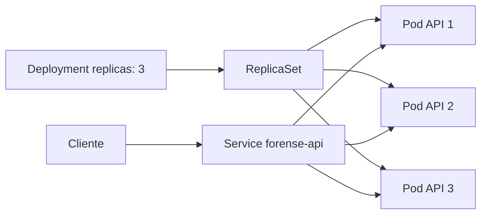
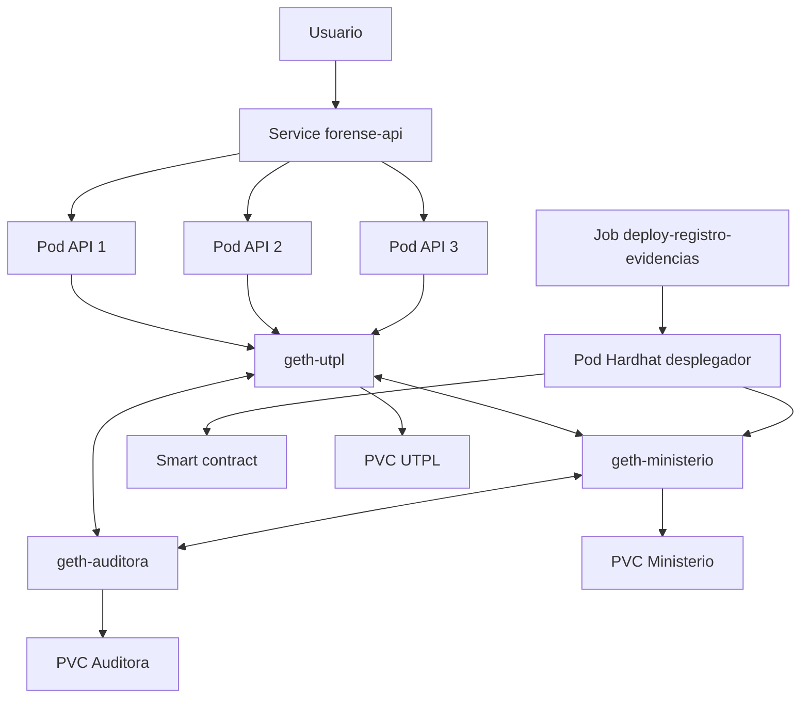

# Orquestación de un smart contract de evidencias digitales mediante Kubernetes

## 1. Introducción

El presente proyecto demuestra la orquestación de una solución blockchain orientada al registro y verificación de evidencias digitales. La implementación utiliza Kubernetes como plataforma de administración de contenedores, Kind para crear un clúster local y Geth para ejecutar una red Ethereum privada con tres nodos. El smart contract se compila con Hardhat 3 y se despliega mediante un Job de Kubernetes, cuyo Pod realiza una tarea finita: conectarse al nodo RPC, enviar la transacción de creación del contrato y publicar su dirección en los registros de ejecución.

La capa de acceso al contrato está formada por una API desplegada mediante un objeto Deployment con `replicas: 3`. Kubernetes crea automáticamente un ReplicaSet, y este mantiene tres Pods de la API disponibles. Un Service de tipo ClusterIP proporciona un punto de acceso estable y distribuye las solicitudes entre las réplicas.

Es importante diferenciar los conceptos utilizados. Los tres nodos Geth representan los participantes de la red blockchain privada y se administran mediante StatefulSets porque conservan datos en volúmenes persistentes. Las tres réplicas solicitadas en la práctica corresponden al Deployment de la API; un único ReplicaSet administrado por Kubernetes mantiene tres Pods idénticos y reemplazables.

## 2. Descripción del smart contract

### 2.1 Objetivo

El contrato `RegistroEvidenciasForenses.sol` tiene como objetivo registrar en blockchain una representación criptográfica de una evidencia digital y permitir su verificación posterior. El archivo original de la evidencia no se almacena en la cadena. En su lugar, se registra su hash, junto con el hash del código de evidencia y el hash del caso relacionado. Esta decisión reduce la exposición de información sensible y permite detectar modificaciones: si el archivo cambia, el hash calculado posteriormente será diferente del valor registrado.

Cada evidencia conserva también la dirección Ethereum del registrador, la fecha de registro obtenida del bloque y un indicador de existencia. La información queda asociada al identificador criptográfico de la evidencia mediante un `mapping` privado.

### 2.2 Estructura de datos

El contrato define la estructura `Evidencia` con los siguientes campos:

| Campo | Tipo | Descripción |
|---|---|---|
| `codigoEvidenciaHash` | `bytes32` | Identificador criptográfico de la evidencia. |
| `evidenciaHash` | `bytes32` | Huella digital del archivo o artefacto forense. |
| `casoHash` | `bytes32` | Identificador criptográfico del caso. |
| `registrador` | `address` | Cuenta que realizó el registro. |
| `fechaRegistro` | `uint256` | Marca temporal del bloque. |
| `existe` | `bool` | Indica si el registro fue creado. |

### 2.3 Funciones principales

**`registrarEvidencia(bytes32, bytes32, bytes32)`** registra una evidencia nueva. La función comprueba que no exista previamente un registro con el mismo código y valida que ninguno de los hashes recibidos sea cero. Después almacena los datos, identifica al registrador con `msg.sender`, registra la fecha con `block.timestamp` y emite el evento `EvidenciaRegistrada`.

**`verificarEvidencia(bytes32, bytes32)`** recibe el código de la evidencia y un hash calculado durante la verificación. Devuelve dos valores: si la evidencia existe y si el hash recibido coincide con el hash almacenado. Esta función permite demostrar si un archivo conserva su integridad.

**`obtenerEvidencia(bytes32)`** consulta el registro asociado al código de evidencia. Devuelve los hashes, la dirección del registrador, la fecha y el indicador de existencia. Al ser una función `view`, no modifica el estado ni genera una nueva transacción.

**`EvidenciaRegistrada`** es el evento emitido después de un registro exitoso. Permite a clientes externos localizar y auditar los registros sin recorrer directamente todo el almacenamiento del contrato.

## 3. Arquitectura de despliegue

### 3.1 Diagrama solicitado: Deployment, Pods y Service



El Deployment declara un estado deseado de tres réplicas. Kubernetes crea un ReplicaSet y este garantiza la disponibilidad de tres Pods. El Service selecciona los Pods mediante la etiqueta `app: forense-api` y ofrece una dirección estable, aunque los Pods sean eliminados y recreados.

### 3.2 Arquitectura blockchain ampliada



Los nodos Geth utilizan el mismo archivo génesis y el identificador de cadena `202606`. Cada nodo dispone de una cuenta validadora y conserva su propia copia de la cadena en un PersistentVolumeClaim. Un Job adicional configura el peering interno mediante los Services de Kubernetes. El Job de Hardhat utiliza el nodo del Ministerio como punto de entrada RPC, pero el contrato queda incorporado en la cadena compartida y puede consultarse desde los demás nodos una vez sincronizados.

## 4. Pasos seguidos para el despliegue en Kubernetes

### 4.1 Verificación del ambiente

Se verificó la disponibilidad de Docker, Kind y kubectl:

```powershell
docker --version
kind --version
kubectl version --client
```

### 4.2 Construcción de imágenes

Se construyeron dos imágenes. La primera contiene Hardhat, el contrato y el script de despliegue. La segunda contiene la API que registra, consulta y verifica evidencias.

```powershell
docker build -t forense-contract:1.0 .\contract
docker build -t forense-api:1.0 .\api
```

### 4.3 Creación del clúster y selección del contexto

El clúster Kind está formado por un nodo de control y dos nodos de trabajo:

```powershell
kind create cluster --name blockchain-forense --config .\infraestructura\kind-cluster.yaml
kubectl config use-context kind-blockchain-forense
kubectl get nodes
```

Después se cargaron las imágenes locales en el clúster:

```powershell
kind load docker-image forense-contract:1.0 --name blockchain-forense
kind load docker-image forense-api:1.0 --name blockchain-forense
```

### 4.4 Aplicación de la configuración base

Se creó el namespace y se aplicaron el archivo génesis y las claves de laboratorio:

```powershell
kubectl apply -f .\kubernetes\00-namespace.yaml
kubectl apply -f .\kubernetes\01-genesis-configmap.yaml
kubectl apply -f .\kubernetes\02-secret-demo.yaml
```

El ConfigMap `geth-genesis` proporciona a los tres nodos la misma configuración de red y el Secret proporciona las claves privadas de las cuentas de prueba. Estas claves son exclusivamente demostrativas y no deben reutilizarse en producción.

### 4.5 Despliegue de la red Geth

Se crearon tres volúmenes persistentes, tres Services internos y tres StatefulSets:

```powershell
kubectl apply -f .\kubernetes\network\03-pvc-geth.yaml
kubectl apply -f .\kubernetes\network\04-services-geth.yaml
kubectl apply -f .\kubernetes\network\05-statefulsets-geth.yaml
```

Se esperó hasta que los nodos estuvieran listos:

```powershell
kubectl -n blockchain-forense rollout status statefulset/geth-utpl --timeout=240s
kubectl -n blockchain-forense rollout status statefulset/geth-ministerio --timeout=240s
kubectl -n blockchain-forense rollout status statefulset/geth-auditora --timeout=240s
```

### 4.6 Configuración de peers

Los nodos se iniciaron con descubrimiento automático deshabilitado. Un Job consulta el `enode` de cada participante y agrega los otros dos como peers mediante la API administrativa de Geth:

```powershell
kubectl apply -f .\kubernetes\network\06-peer-script-configmap.yaml
kubectl apply -f .\kubernetes\network\07-job-configurar-peers.yaml
kubectl -n blockchain-forense wait --for=condition=complete job/configurar-peers-geth --timeout=240s
kubectl -n blockchain-forense logs job/configurar-peers-geth
```

La salida esperada muestra dos peers por nodo y finaliza con `PEERING_OK=true`.

### 4.7 Despliegue del contrato mediante un Pod

El manifiesto `08-job-deploy-contract.yaml` define un ConfigMap con la dirección RPC y un objeto Job. Kubernetes crea un Pod basado en la imagen `forense-contract:1.0`. El contenedor ejecuta:

```text
npx hardhat run scripts/deploy-registro-evidencias.ts --network redForense
```

Aplicación y verificación:

```powershell
kubectl apply -f .\kubernetes\jobs\08-job-deploy-contract.yaml
kubectl -n blockchain-forense wait --for=condition=complete job/deploy-registro-evidencias --timeout=300s
kubectl -n blockchain-forense logs job/deploy-registro-evidencias
```

El log imprime la dirección del contrato con el formato `CONTRACT_ADDRESS=0x...`. Esta evidencia demuestra que el Pod ejecutó la lógica de despliegue y terminó correctamente.

### 4.8 Configuración y despliegue de la API

La dirección obtenida se almacenó en un ConfigMap, sin reconstruir la imagen:

```powershell
$contractAddress = "0xd3aa556287afe63102e5797bfddd2a1e8dbb3ea5"

kubectl -n blockchain-forense create configmap forense-api-config `
  --from-literal=BLOCKCHAIN_RPC_URL=http://geth-utpl:8545 `
  --from-literal=CONTRACT_ADDRESS=$contractAddress `
  --from-literal=CHAIN_ID=202606 `
  --dry-run=client -o yaml | kubectl apply -f -
```

Finalmente se aplicaron el Deployment y el Service:

```powershell
kubectl apply -f .\kubernetes\api\09-deployment-api.yaml
kubectl apply -f .\kubernetes\api\10-service-api.yaml
kubectl -n blockchain-forense rollout status deployment/forense-api --timeout=240s
```

### 4.9 Verificación de las tres réplicas

```powershell
kubectl -n blockchain-forense get deployment forense-api
kubectl -n blockchain-forense get replicasets
kubectl -n blockchain-forense get pods -l app=forense-api -o wide
kubectl -n blockchain-forense get service forense-api
```

El resultado debe mostrar `3/3` Pods disponibles. La presencia del ReplicaSet puede verificarse con `kubectl get replicasets`, aunque su nombre contiene un sufijo generado automáticamente.

## 5. Demostración de funcionamiento

Para acceder a la API desde el equipo local se utilizó un port-forward:

```powershell
kubectl -n blockchain-forense port-forward svc/forense-api 8080:80
```

La ruta `/` devuelve el nombre del Pod que atendió la solicitud. Al realizar varias solicitudes se puede observar que el Service distribuye el tráfico entre las réplicas.

El registro de una evidencia se realizó mediante una solicitud HTTP POST con el código de evidencia, el hash del archivo y el identificador del caso. El contrato emitió una transacción y almacenó los valores criptográficos. Después se ejecutó la verificación con el mismo hash, obteniendo `evidenciaCoincide: true`. Al utilizar un hash diferente, el resultado esperado es `false`, lo que demuestra la detección de una alteración.

## 6. Demostración de autorrecuperación

Para comprobar la función del ReplicaSet se eliminó uno de los Pods de la API:

```powershell
$pod = kubectl -n blockchain-forense get pod -l app=forense-api -o jsonpath="{.items[0].metadata.name}"
kubectl -n blockchain-forense delete pod $pod
kubectl -n blockchain-forense get pods -l app=forense-api -w
```

Después de la eliminación, el ReplicaSet detectó que el número real de Pods era inferior al estado deseado y creó una nueva instancia. El sistema volvió automáticamente a tres réplicas, demostrando autorrecuperación y continuidad del servicio.

## 7. Conclusiones

La práctica integra el despliegue de blockchain y la orquestación de aplicaciones en Kubernetes. El Job de Hardhat representa correctamente una tarea finita de despliegue, mientras que el Deployment administra una carga de trabajo permanente y escalable. El ReplicaSet garantiza tres Pods de la API y el Service proporciona un punto de acceso estable. Los StatefulSets y PVC permiten que los nodos Geth conserven la cadena incluso después de la recreación de sus Pods.

La solución demuestra que Kubernetes no modifica la lógica del smart contract; su función es administrar los contenedores, la red interna, la configuración, el almacenamiento y la disponibilidad de los componentes que compilan, despliegan y consumen el contrato. En conjunto, el proyecto permite registrar hashes de evidencias digitales, verificar su integridad y demostrar el comportamiento de recuperación automática requerido por la actividad.


