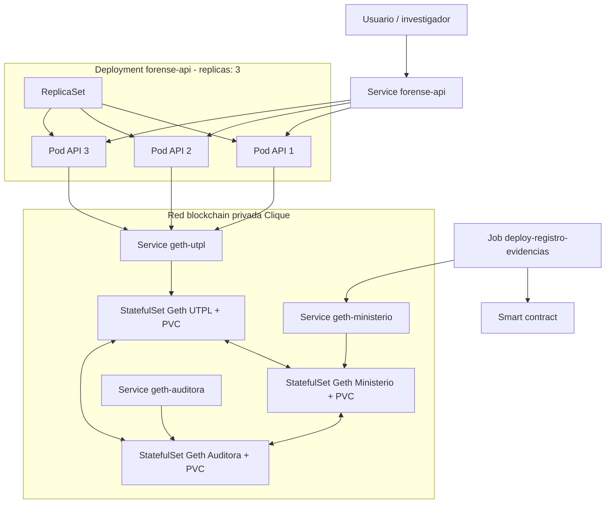

# Orquestación de blockchain forense con Kubernetes

Proyecto académico para implementar y demostrar la orquestación de un smart contract de registro y verificación de evidencias digitales en un clúster Kubernetes local creado con Kind.

La solución integra:

- una red Ethereum privada con **tres nodos Geth**;
- consenso Clique PoA para el laboratorio;
- un proyecto **Hardhat 3** que compila y despliega `RegistroEvidenciasForenses.sol`;
- un **Job de Kubernetes**, cuyo Pod ejecuta la lógica de despliegue;
- una API Node.js que interactúa con el contrato;
- un **Deployment con tres réplicas**, administradas por un único ReplicaSet;
- un Service `ClusterIP` que distribuye solicitudes entre los tres Pods;
- PVC independientes para conservar la cadena de cada nodo Geth.

> Las claves incluidas en `kubernetes/02-secret-demo.yaml` son exclusivamente para un laboratorio local. No deben utilizarse en ambientes reales.

## Aclaración conceptual

Los **tres nodos Geth** son participantes distintos de la red blockchain y se administran mediante tres `StatefulSet`. Las **tres réplicas solicitadas** corresponden a la API: se declara un `Deployment` con `replicas: 3`; Kubernetes crea un ReplicaSet y este conserva tres Pods idénticos.

## Arquitectura



## Estructura

```text
blockchain-forense-kubernetes/
├── api/                         # API que consume el contrato
├── contract/                    # Hardhat 3 y contrato Solidity
├── infraestructura/             # Clúster Kind
├── kubernetes/
│   ├── network/                 # Geth, Services, PVC y peering
│   ├── jobs/                    # Job de despliegue
│   └── api/                     # Deployment y Service de la API
├── scripts/                     # Automatización PowerShell
├── docs/                        # Diagramas
```

## Requisitos

- Docker Desktop.
- Kind.
- kubectl.
- PowerShell.
- Al menos 6 GB de memoria asignados a Docker Desktop.

```powershell
docker --version
kind --version
kubectl version --client
```

## Despliegue automático

Desde la raíz del proyecto:

```powershell
Set-ExecutionPolicy -Scope Process Bypass
.\scripts\deploy-all.ps1
```

El script:

1. construye `forense-contract:1.0` y `forense-api:1.0`;
2. crea el clúster Kind `blockchain-forense`;
3. carga las imágenes locales en Kind;
4. despliega los tres nodos Geth;
5. configura el peering;
6. ejecuta el Job Hardhat;
7. obtiene `CONTRACT_ADDRESS` de los logs;
8. crea el ConfigMap de la API;
9. despliega la API con tres réplicas y su Service.

## Despliegue manual

### 1. Construir imágenes

```powershell
docker build -t forense-contract:1.0 .\contract
docker build -t forense-api:1.0 .\api
```

### 2. Crear el clúster y seleccionar el contexto

```powershell
kind create cluster --name blockchain-forense --config .\infraestructura\kind-cluster.yaml
kubectl config use-context kind-blockchain-forense
kubectl get nodes
```

### 3. Cargar imágenes en Kind

```powershell
kind load docker-image forense-contract:1.0 --name blockchain-forense
kind load docker-image forense-api:1.0 --name blockchain-forense
```

### 4. Aplicar la configuración base y la red Geth

```powershell
kubectl apply -f .\kubernetes\00-namespace.yaml
kubectl apply -f .\kubernetes\01-genesis-configmap.yaml
kubectl apply -f .\kubernetes\02-secret-demo.yaml
kubectl apply -f .\kubernetes\network\03-pvc-geth.yaml
kubectl apply -f .\kubernetes\network\04-services-geth.yaml
kubectl apply -f .\kubernetes\network\05-statefulsets-geth.yaml
```

```powershell
kubectl -n blockchain-forense rollout status statefulset/geth-utpl --timeout=240s
kubectl -n blockchain-forense rollout status statefulset/geth-ministerio --timeout=240s
kubectl -n blockchain-forense rollout status statefulset/geth-auditora --timeout=240s
```

### 5. Configurar los peers

```powershell
kubectl apply -f .\kubernetes\network\06-peer-script-configmap.yaml
kubectl apply -f .\kubernetes\network\07-job-configurar-peers.yaml
kubectl -n blockchain-forense wait --for=condition=complete job/configurar-peers-geth --timeout=240s
kubectl -n blockchain-forense logs job/configurar-peers-geth
```

### 6. Desplegar el smart contract

```powershell
kubectl apply -f .\kubernetes\jobs\08-job-deploy-contract.yaml
kubectl -n blockchain-forense wait --for=condition=complete job/deploy-registro-evidencias --timeout=300s
kubectl -n blockchain-forense logs job/deploy-registro-evidencias
```

El log debe contener:

```text
CONTRACT_ADDRESS=0x...
```

### 7. Crear el ConfigMap de la API

```powershell
$contractAddress = "0xDIRECCION_OBTENIDA"

kubectl -n blockchain-forense create configmap forense-api-config `
  --from-literal=BLOCKCHAIN_RPC_URL=http://geth-utpl:8545 `
  --from-literal=CONTRACT_ADDRESS=$contractAddress `
  --from-literal=CHAIN_ID=202606 `
  --dry-run=client -o yaml | kubectl apply -f -
```

### 8. Aplicar Deployment y Service

```powershell
kubectl apply -f .\kubernetes\api\09-deployment-api.yaml
kubectl apply -f .\kubernetes\api\10-service-api.yaml
kubectl -n blockchain-forense rollout status deployment/forense-api --timeout=240s
```

### 9. Verificar las tres réplicas

```powershell
kubectl -n blockchain-forense get deployments
kubectl -n blockchain-forense get replicasets
kubectl -n blockchain-forense get pods -l app=forense-api -o wide
kubectl -n blockchain-forense get services
kubectl -n blockchain-forense get jobs
```

## Demostración

```powershell
.\scripts\demo.ps1
```

El script realiza solicitudes a través del Service, registra una evidencia, verifica su hash, consulta el registro y elimina un Pod para demostrar que el ReplicaSet vuelve a mantener tres réplicas.

## Endpoints

- `GET /`
- `GET /health`
- `POST /evidencias`
- `POST /evidencias/verificar`
- `GET /evidencias/:codigo`

Ejemplo de registro:

```json
{
  "codigoEvidencia": "EV-2026-001",
  "hashEvidencia": "aaaaaaaaaaaaaaaaaaaaaaaaaaaaaaaaaaaaaaaaaaaaaaaaaaaaaaaaaaaaaaaa",
  "caso": "CASO-K8S-001"
}
```

## Limitaciones del laboratorio

- Las claves son públicas y de prueba.
- La API comparte una cuenta firmante entre tres réplicas; no está diseñada para un alto volumen de transacciones concurrentes.
- La interfaz RPC administrativa de Geth se habilita para configurar peers dentro del clúster.
- Antes de una implementación real se requieren gestión segura de secretos, TLS, control de acceso, observabilidad y una estrategia de firma/nonce de producción.
