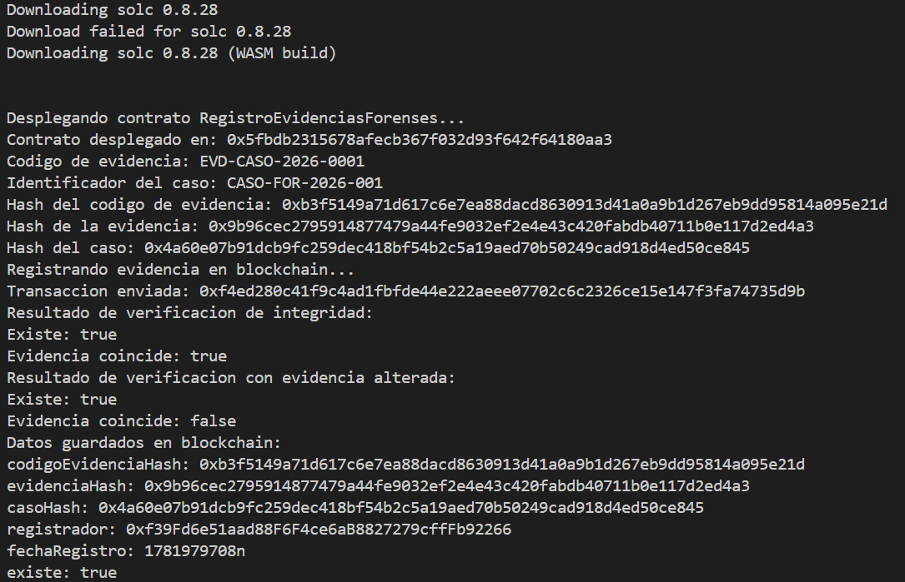

# Blockchain Forense - Registro de Evidencias Digitales

Proyecto Hardhat 3 orientado a la implementación inicial de un smart contract para registrar y verificar evidencias digitales en procesos de análisis forense.

El contrato principal es `RegistroEvidenciasForenses.sol` y forma parte del proyecto:

**Diseño de un modelo basado en blockchain para garantizar la integridad y trazabilidad de evidencias digitales en procesos de análisis forense.**

## Objetivo

Implementar un contrato inteligente en Solidity que permita registrar la huella criptográfica de una evidencia digital y verificar posteriormente su integridad mediante blockchain.

El contrato no almacena archivos originales ni información sensible de la evidencia. En su lugar, almacena hashes criptográficos que permiten comprobar si una evidencia fue modificada después de su registro.

## Estructura importante del proyecto

```text
blockchainForense/
├── Dockerfile
├── hardhat.config.ts
├── package.json
├── package-lock.json
├── tsconfig.json
├── contracts/
│   └── RegistroEvidenciasForenses.sol
└── scripts/
    ├── crear-evidencia.ts
    └── deploy-registro-evidencias.ts
```

## Tecnologías utilizadas

- Solidity 0.8.28
- Hardhat 3
- TypeScript
- Viem
- Docker
- Node.js 22 Alpine

## Instalación local

Instalar dependencias:

```powershell
npm install
```

Compilar:

```powershell
npx hardhat compile
```

Ejecutar demo local con red temporal de Hardhat:

```powershell
npx hardhat run scripts/crear-evidencia.ts
```

Desplegar únicamente el contrato en la red temporal de Hardhat:

```powershell
npx hardhat run scripts/deploy-registro-evidencias.ts
```

## Ejecución con Docker

Construir la imagen Docker:

```powershell

docker build -t registro-evidencias .
```

```powershell
docker run --rm registro-evidencias
```

## Resultado de ejecución

La siguiente imagen muestra la ejecución del contrato `RegistroEvidenciasForenses`, donde se despliega el contrato, se registra una evidencia, se verifica su integridad y se comprueba una evidencia alterada.

